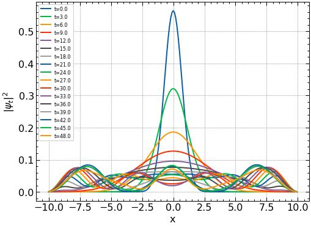
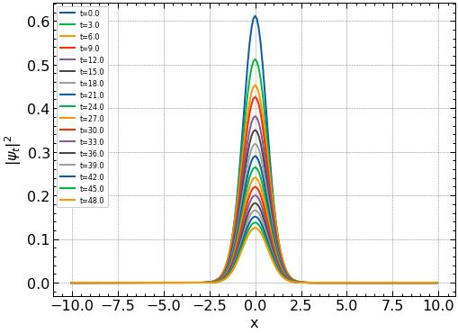

# Crank-Nicholson technique for solving the Schrodinger equation
## Final NLA project
In this study, solutions for the linear one-dimensional Schrödinger equation are obtained by using Crank–Nicolson method. The SLAE with three-diagonal matrix is appeared. We will compare the results for different parameters with analytical solution, and estimate accuracy. In addition it will be observed, how to use Crank-Nicholson method in multidimensional case.

#### Team: Sprat in Tomato
- Ivan Gurev
- Nikolay Kotoyants
- Ekaterina Andreichuk
- Antonina Kurdyukova

#### Requirements for launching code
```bat
pip install -r requirements.txt
```
[requirements.txt](https://raw.githubusercontent.com/Tonchik-hv/Crank-Nicholson-techique/main/code/requirements%20(1).txt)

#### Run the experiment:
[Google Colab](https://colab.research.google.com/drive/1gEyjGSFO83QNcnld5gcKQjIraO2V_RNX?usp=sharing)

#### Results
Solution for the Schrodinger equation for potential $V(x) = 0$ and gaussian initial condition.




